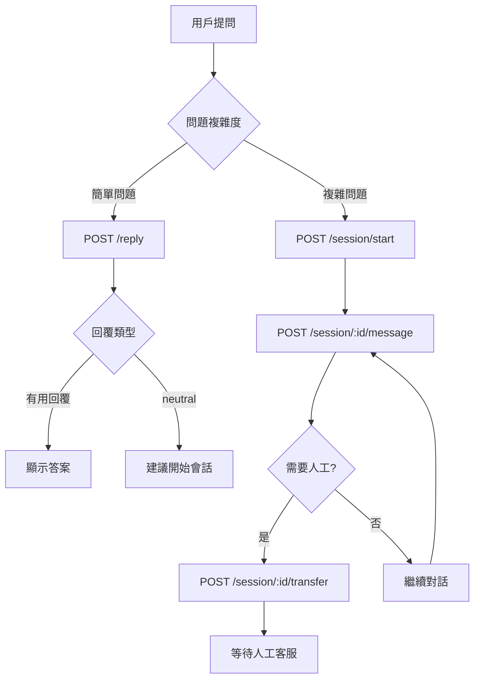

# 🤖 智能回覆系統 - 前端 API 使用指南

## 📋 概述

智能回覆系統提供兩種主要功能：

1. **關鍵字搜索** - 基於知識庫的即時智能回覆（無狀態）
2. **會話管理** - 支援多輪對話的客服會話系統（有狀態）

**基礎 URL**: `/api/v1/smart-reply`

---

## 🎯 核心功能：關鍵字搜索

### `POST /reply` - 智能回覆（推薦使用）

最重要的 API，基於關鍵字匹配提供即時回覆。

**請求格式**：

```json
{
  "message": "如何購票？",
  "enableAI": false // 可選，是否啟用 AI 後備
}
```

**回應格式**：

```json
{
  "success": true,
  "data": {
    "type": "tutorial|faq|knowledge|neutral|ai_fallback",
    "message": "詳細的回覆內容...",
    "data": {
      "confidence": 0.85
    },
    "metadata": {
      "processingTime": 120,
      "strategy": "keyword_match",
      "matchedKeywords": ["購票", "買票"]
    }
  }
}
```

**回覆類型說明**：

- `tutorial`: 教學類回覆（含教學連結）
- `faq`: 常見問題回覆
- `knowledge`: 一般知識庫回覆
- `neutral`: 無匹配結果（建議轉人工）
- `ai_fallback`: AI 後備回覆（需啟用 enableAI）

**使用範例**：

```javascript
// 基本使用
const response = await fetch("/api/v1/smart-reply/reply", {
  method: "POST",
  headers: { "Content-Type": "application/json" },
  body: JSON.stringify({
    message: "忘記密碼怎麼辦？",
  }),
});

const result = await response.json();
console.log("回覆類型:", result.data.type);
console.log("回覆內容:", result.data.message);
console.log("信心度:", result.data.data.confidence);
```

---

## 💬 會話管理功能

### 1. `POST /session/start` - 開始會話

創建新的客服會話，支援匿名用戶。

**請求格式**：

```json
{
  "userId": "user-uuid", // 可選，匿名用戶可不提供
  "category": "票務問題", // 可選，會話分類
  "initialMessage": "你好" // 可選，初始訊息
}
```

**回應格式**：

```json
{
  "success": true,
  "message": "會話已開始",
  "data": {
    "sessionId": "session-uuid",
    "status": "active",
    "botMessage": {
      // 如果提供了 initialMessage
      "text": "您好！有什麼可以幫助您的嗎？",
      "type": "knowledge",
      "confidence": 0.9
    }
  }
}
```

### 2. `POST /session/:sessionId/message` - 發送訊息

在會話中發送訊息並獲得回覆。

**請求格式**：

```json
{
  "message": "我想要退票"
}
```

**回應格式**：

```json
{
  "success": true,
  "message": "訊息已發送",
  "data": {
    "botMessage": {
      "text": "退票相關說明...",
      "type": "faq",
      "confidence": 0.88
    },
    "sessionStatus": "active" // active|waiting|closed
  }
}
```

### 3. `GET /session/:sessionId/history` - 獲取會話歷史

取得完整的會話記錄。

**回應格式**：

```json
{
  "success": true,
  "data": {
    "session": {
      "sessionId": "session-uuid",
      "status": "active",
      "category": "票務問題",
      "createdAt": "2024-01-15T10:00:00.000Z",
      "firstResponseAt": "2024-01-15T10:00:01.000Z"
    },
    "messages": [
      {
        "messageId": "msg-uuid",
        "senderType": "user",
        "messageText": "你好",
        "messageType": "text",
        "createdAt": "2024-01-15T10:00:00.000Z"
      },
      {
        "messageId": "msg-uuid",
        "senderType": "bot",
        "messageText": "您好！有什麼可以幫助您的嗎？",
        "messageType": "text",
        "metadata": {
          "confidence": 0.9
        },
        "createdAt": "2024-01-15T10:00:01.000Z"
      }
    ]
  }
}
```

### 4. `POST /session/:sessionId/transfer` - 申請人工轉接

當智能回覆無法解決問題時，申請轉接人工客服。

**請求格式**：

```json
{
  "reason": "問題複雜需要人工處理" // 可選
}
```

**回應格式**：

```json
{
  "success": true,
  "message": "已申請人工客服轉接",
  "data": {
    "sessionId": "session-uuid",
    "status": "waiting",
    "waitingMessage": "您的轉接申請已提交，客服人員將盡快為您服務。"
  }
}
```

### 5. `POST /session/:sessionId/close` - 關閉會話

結束客服會話。

**回應格式**：

```json
{
  "success": true,
  "message": "會話已關閉",
  "data": {
    "sessionId": "session-uuid",
    "status": "closed",
    "closedAt": "2024-01-15T10:30:00.000Z"
  }
}
```

---

## 🛠 輔助功能

### `POST /test` - 測試關鍵字匹配

開發和測試用，檢查關鍵字匹配效果。

**請求格式**：

```json
{
  "message": "購票流程"
}
```

**回應格式**：

```json
{
  "success": true,
  "data": {
    "input": "購票流程",
    "result": {
      "type": "tutorial",
      "strategy": "keyword_match",
      "matchedKeywords": ["購票", "流程"],
      "confidence": 0.85,
      "processingTime": 45
    },
    "response": "購票教學內容..."
  }
}
```

### `GET /health` - 系統健康檢查

檢查系統狀態。

**回應格式**：

```json
{
  "success": true,
  "message": "智能回覆系統運行正常",
  "data": {
    "features": {
      "keywordMatching": true,
      "knowledgeBaseSearch": true,
      "sessionManagement": true,
      "humanTransfer": true,
      "aiBackup": true
    },
    "timestamp": "2024-01-15T10:00:00.000Z"
  }
}
```

---

## 🔐 身份驗證

### 已登入用戶

```javascript
headers: {
  'Authorization': 'Bearer YOUR_JWT_TOKEN',
  'Content-Type': 'application/json'
}
```

### 匿名用戶

```javascript
headers: {
  'Content-Type': 'application/json'
  // 不需要 Authorization header
}
```

---

## 📱 前端整合範例

### React Hook 範例

```javascript
import { useState, useCallback } from "react";

const useSmartReply = () => {
  const [loading, setLoading] = useState(false);
  const [sessionId, setSessionId] = useState(null);

  // 關鍵字搜索（推薦用於快速問答）
  const quickReply = useCallback(async (message) => {
    setLoading(true);
    try {
      const response = await fetch("/api/v1/smart-reply/reply", {
        method: "POST",
        headers: { "Content-Type": "application/json" },
        body: JSON.stringify({ message, enableAI: true }),
      });

      const result = await response.json();

      // 如果是中性回覆，建議開始會話
      if (result.data.type === "neutral") {
        console.log("建議開始會話獲得更好服務");
      }

      return result.data;
    } catch (error) {
      console.error("快速回覆失敗:", error);
      throw error;
    } finally {
      setLoading(false);
    }
  }, []);

  // 開始會話
  const startSession = useCallback(async (initialMessage) => {
    setLoading(true);
    try {
      const response = await fetch("/api/v1/smart-reply/session/start", {
        method: "POST",
        headers: { "Content-Type": "application/json" },
        body: JSON.stringify({
          category: "一般諮詢",
          initialMessage,
        }),
      });

      const result = await response.json();
      setSessionId(result.data.sessionId);
      return result.data;
    } catch (error) {
      console.error("開始會話失敗:", error);
      throw error;
    } finally {
      setLoading(false);
    }
  }, []);

  // 會話中發送訊息
  const sendMessage = useCallback(
    async (message) => {
      if (!sessionId) throw new Error("請先開始會話");

      setLoading(true);
      try {
        const response = await fetch(
          `/api/v1/smart-reply/session/${sessionId}/message`,
          {
            method: "POST",
            headers: { "Content-Type": "application/json" },
            body: JSON.stringify({ message }),
          }
        );

        const result = await response.json();
        return result.data;
      } catch (error) {
        console.error("發送訊息失敗:", error);
        throw error;
      } finally {
        setLoading(false);
      }
    },
    [sessionId]
  );

  // 申請人工轉接
  const requestTransfer = useCallback(
    async (reason) => {
      if (!sessionId) throw new Error("請先開始會話");

      try {
        const response = await fetch(
          `/api/v1/smart-reply/session/${sessionId}/transfer`,
          {
            method: "POST",
            headers: { "Content-Type": "application/json" },
            body: JSON.stringify({ reason }),
          }
        );

        const result = await response.json();
        return result.data;
      } catch (error) {
        console.error("申請轉接失敗:", error);
        throw error;
      }
    },
    [sessionId]
  );

  return {
    loading,
    sessionId,
    quickReply, // 快速問答（無狀態）
    startSession, // 開始會話
    sendMessage, // 會話對話
    requestTransfer, // 申請轉接
  };
};

export default useSmartReply;
```

### Vue 3 Composition API 範例

```javascript
import { ref, computed } from "vue";

export function useSmartReply() {
  const loading = ref(false);
  const sessionId = ref(null);
  const messages = ref([]);

  const isInSession = computed(() => !!sessionId.value);

  // 快速回覆
  const quickReply = async (message) => {
    loading.value = true;
    try {
      const response = await fetch("/api/v1/smart-reply/reply", {
        method: "POST",
        headers: { "Content-Type": "application/json" },
        body: JSON.stringify({ message }),
      });

      return await response.json();
    } finally {
      loading.value = false;
    }
  };

  // 開始會話
  const startSession = async (initialMessage) => {
    loading.value = true;
    try {
      const response = await fetch("/api/v1/smart-reply/session/start", {
        method: "POST",
        headers: { "Content-Type": "application/json" },
        body: JSON.stringify({
          initialMessage,
          category: "一般諮詢",
        }),
      });

      const result = await response.json();
      sessionId.value = result.data.sessionId;

      // 初始化訊息記錄
      if (result.data.botMessage) {
        messages.value = [
          { sender: "user", text: initialMessage, timestamp: new Date() },
          {
            sender: "bot",
            text: result.data.botMessage.text,
            timestamp: new Date(),
          },
        ];
      }

      return result.data;
    } finally {
      loading.value = false;
    }
  };

  return {
    loading: readonly(loading),
    sessionId: readonly(sessionId),
    messages: readonly(messages),
    isInSession,
    quickReply,
    startSession,
  };
}
```

---

## ❌ 錯誤處理

### 常見錯誤碼

```javascript
const handleApiError = (error, response) => {
  switch (response.status) {
    case 400:
      console.error("請求格式錯誤:", error.message);
      break;
    case 401:
      console.error("認證失敗，請重新登入");
      break;
    case 403:
      console.error("無權限訪問此會話");
      break;
    case 404:
      console.error("會話不存在");
      break;
    case 500:
      console.error("服務器錯誤，請稍後再試");
      break;
    default:
      console.error("未知錯誤:", error.message);
  }
};
```

---

## 🎨 UI/UX 建議

### 使用場景建議

1. **快速問答場景**：使用 `/reply` API

   - 適用於：首頁快速問答、搜索建議
   - 優點：響應快速、無狀態、簡單

2. **深度客服場景**：使用會話管理 APIs
   - 適用於：客服中心、複雜問題解決
   - 優點：支援多輪對話、可轉人工

### 用戶體驗優化

```javascript
// 自動降級策略
const smartChat = async (message) => {
  // 1. 先嘗試快速回覆
  const quickResult = await quickReply(message);

  // 2. 如果是中性回覆，自動開啟會話
  if (quickResult.type === "neutral") {
    const sessionResult = await startSession(message);
    return sessionResult;
  }

  return quickResult;
};
```

---

## 📊 效能優化建議

1. **請求去重**：相同問題短時間內不重複請求
2. **結果緩存**：常見問題結果可以緩存 5-10 分鐘
3. **錯誤重試**：網絡錯誤時自動重試，最多 3 次
4. **超時設定**：設定 10-15 秒請求超時

---

## 🚀 完整使用流程



這份文件涵蓋了智能回覆系統的所有功能，您的前端團隊可以根據這個指南進行整合開發！
