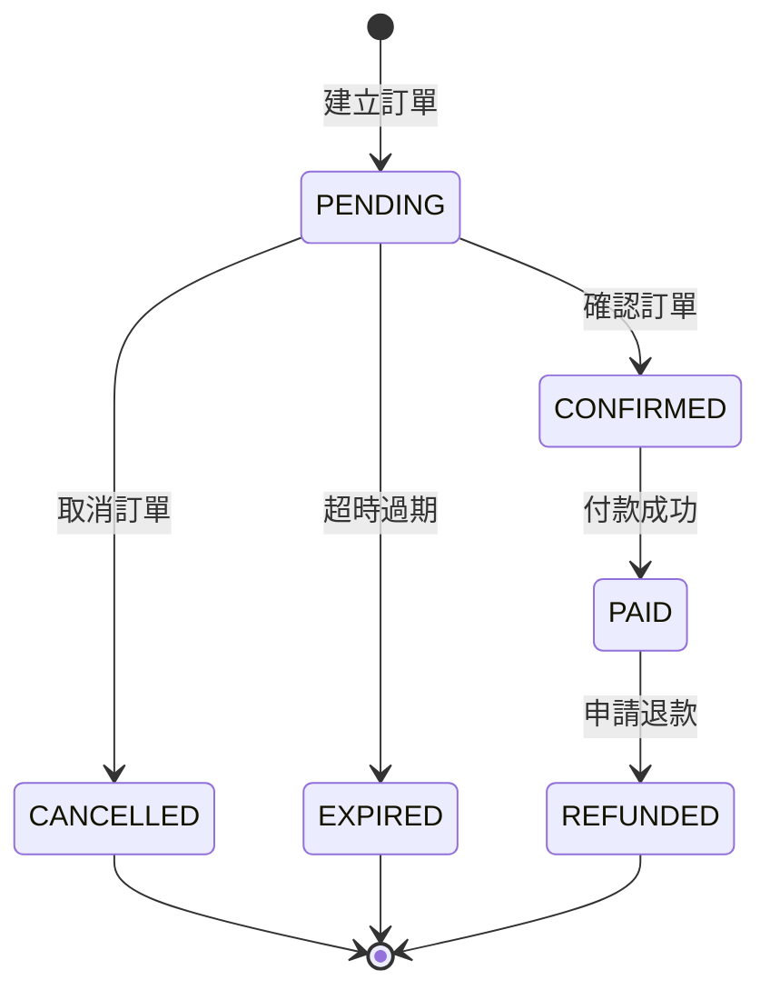

# 第八章：訂單與支付系統

## 章節概述
本章節詳細介紹 Tickeasy 訂單與支付系統的設計與實作，包括訂單生命週期管理、金流整合、支付處理和退款機制等核心功能。

## 目錄
1. [訂單生命週期管理](./01-order-lifecycle.md)
2. [支付系統整合](./02-payment-integration.md)
3. [ECPay 金流整合](./03-ecpay-integration.md)
4. [訂單管理功能](./04-order-management.md)
5. [退款處理機制](./05-refund-system.md)

## 核心實體
- **Order**: 訂單主體 (用戶、票券、金額)
- **Payment**: 支付記錄 (交易、狀態、金流)
- **Refund**: 退款記錄 (原因、狀態、金額)

## 學習目標
完成本章節後，您將能夠：
1. 設計完整的訂單處理流程
2. 整合第三方支付服務 (ECPay)
3. 實作安全的支付驗證機制
4. 建立訂單狀態管理系統
5. 處理退款與例外情況

## 訂單資料模型

```typescript
interface Order {
  id: string;                 // UUID 主鍵
  orderNumber: string;        // 訂單編號 (唯一)
  userId: string;             // 用戶 ID (外鍵)
  status: OrderStatus;        // 訂單狀態
  totalAmount: number;        // 總金額
  discountAmount: number;     // 折扣金額
  contactInfo: ContactInfo;   // 聯絡資訊
  billingInfo?: BillingInfo;  // 帳單資訊
  expiresAt?: Date;          // 過期時間
  createdAt: Date;           // 建立時間
  updatedAt: Date;           // 更新時間
  
  // 關聯關係
  user: User;                // 用戶資訊
  tickets: Ticket[];         // 票券列表
  payment?: Payment;         // 支付記錄
  refunds: Refund[];         // 退款記錄
}

enum OrderStatus {
  PENDING = 'pending',       // 待付款
  CONFIRMED = 'confirmed',   // 已確認
  PAID = 'paid',            // 已付款
  CANCELLED = 'cancelled',   // 已取消
  EXPIRED = 'expired',       // 已過期
  REFUNDED = 'refunded'      // 已退款
}

interface Payment {
  id: string;                // UUID 主鍵
  orderId: string;           // 訂單 ID (外鍵)
  paymentMethod: string;     // 支付方式 (credit_card, atm, etc.)
  amount: number;            // 支付金額
  currency: string;          // 貨幣 (TWD)
  status: PaymentStatus;     // 支付狀態
  transactionId?: string;    // 交易 ID (第三方)
  paymentDetails: any;       // 支付詳細資訊
  paidAt?: Date;             // 付款時間
  createdAt: Date;           // 建立時間
  updatedAt: Date;           // 更新時間
  
  // 關聯關係
  order: Order;              // 訂單資訊
}

enum PaymentStatus {
  PENDING = 'pending',       // 待付款
  PROCESSING = 'processing', // 處理中
  COMPLETED = 'completed',   // 已完成
  FAILED = 'failed',         // 失敗
  CANCELLED = 'cancelled',   // 已取消
  REFUNDED = 'refunded'      // 已退款
}
```

## API 端點概覽

```http
# 訂單管理
POST   /api/v1/orders              # 建立訂單
GET    /api/v1/orders              # 取得訂單列表
GET    /api/v1/orders/:id          # 取得訂單詳情
PUT    /api/v1/orders/:id          # 更新訂單
DELETE /api/v1/orders/:id          # 取消訂單

# 支付處理
POST   /api/v1/payments            # 建立支付
GET    /api/v1/payments/:id        # 取得支付詳情
POST   /api/v1/payments/webhook    # 支付回調 (ECPay)
POST   /api/v1/payments/verify     # 驗證支付結果

# 退款處理
POST   /api/v1/refunds             # 申請退款
GET    /api/v1/refunds/:id         # 取得退款詳情
PUT    /api/v1/refunds/:id/approve # 核准退款
PUT    /api/v1/refunds/:id/reject  # 拒絕退款
```

## 訂單處理流程

### 1. 訂單建立流程
```typescript
async function createOrder(userId: string, orderData: CreateOrderDto) {
  return await AppDataSource.transaction(async manager => {
    // 1. 驗證票券可用性
    await validateTicketAvailability(orderData.tickets);
    
    // 2. 計算訂單金額
    const { totalAmount, discountAmount } = calculateOrderAmount(orderData);
    
    // 3. 建立訂單
    const order = await manager.save(Order, {
      orderNumber: generateOrderNumber(),
      userId,
      status: OrderStatus.PENDING,
      totalAmount,
      discountAmount,
      contactInfo: orderData.contactInfo,
      expiresAt: new Date(Date.now() + 15 * 60 * 1000) // 15分鐘過期
    });
    
    // 4. 更新票券狀態為已預訂
    await updateTicketStatus(orderData.tickets, TicketStatus.RESERVED, order.id);
    
    // 5. 建立支付記錄
    const payment = await createPaymentRecord(order);
    
    return { order, payment };
  });
}
```

### 2. 支付處理流程
```typescript
async function processPayment(orderId: string, paymentData: PaymentDto) {
  // 1. 驗證訂單狀態
  const order = await validateOrderForPayment(orderId);
  
  // 2. 整合 ECPay 支付
  const ecpayResult = await ecpayService.createPayment({
    MerchantTradeNo: order.orderNumber,
    TotalAmount: order.totalAmount,
    TradeDesc: `Tickeasy 票券訂單 - ${order.orderNumber}`,
    ItemName: '演唱會門票',
    ReturnURL: `${process.env.API_URL}/api/v1/payments/webhook`,
    ClientBackURL: `${process.env.FRONTEND_URL}/orders/${order.id}/success`
  });
  
  // 3. 更新支付記錄
  await updatePaymentRecord(order.payment.id, {
    transactionId: ecpayResult.TradeNo,
    status: PaymentStatus.PROCESSING,
    paymentDetails: ecpayResult
  });
  
  return ecpayResult;
}
```

### 3. 支付回調處理
```typescript
async function handlePaymentWebhook(webhookData: ECPayWebhookDto) {
  return await AppDataSource.transaction(async manager => {
    // 1. 驗證回調簽章
    const isValid = ecpayService.verifyWebhook(webhookData);
    if (!isValid) throw new Error('Invalid webhook signature');
    
    // 2. 更新支付狀態
    const payment = await manager.findOne(Payment, {
      where: { transactionId: webhookData.TradeNo },
      relations: ['order', 'order.tickets']
    });
    
    if (webhookData.RtnCode === '1') {
      // 支付成功
      await manager.update(Payment, payment.id, {
        status: PaymentStatus.COMPLETED,
        paidAt: new Date()
      });
      
      await manager.update(Order, payment.order.id, {
        status: OrderStatus.PAID
      });
      
      // 更新票券狀態
      await updateTicketsStatus(payment.order.tickets, TicketStatus.SOLD);
      
      // 發送確認郵件
      await emailService.sendOrderConfirmation(payment.order);
    } else {
      // 支付失敗
      await manager.update(Payment, payment.id, {
        status: PaymentStatus.FAILED
      });
      
      await manager.update(Order, payment.order.id, {
        status: OrderStatus.CANCELLED
      });
      
      // 釋放票券
      await updateTicketsStatus(payment.order.tickets, TicketStatus.AVAILABLE);
    }
  });
}
```

## ECPay 金流整合

### 1. ECPay 設定
```typescript
class ECPayService {
  private merchantId: string;
  private hashKey: string;
  private hashIV: string;
  private baseUrl: string;
  
  constructor() {
    this.merchantId = process.env.ECPAY_MERCHANT_ID;
    this.hashKey = process.env.ECPAY_HASH_KEY;
    this.hashIV = process.env.ECPAY_HASH_IV;
    this.baseUrl = process.env.ECPAY_BASE_URL;
  }
  
  async createPayment(paymentData: ECPayPaymentDto) {
    // 生成檢查碼
    const checkMacValue = this.generateCheckMacValue(paymentData);
    
    // 發送到 ECPay
    const response = await axios.post(`${this.baseUrl}/Cashier/AioCheckOut/V5`, {
      ...paymentData,
      CheckMacValue: checkMacValue
    });
    
    return response.data;
  }
}
```

### 2. 支付方式設定
- **信用卡**: 即時付款，手續費 2.8%
- **ATM 轉帳**: 3天付款期限，手續費固定 $10
- **超商代碼**: 3天付款期限，手續費 $25
- **超商條碼**: 即時列印，手續費 $15

## 訂單狀態管理

### 訂單狀態轉換圖


## 核心特性
- ✅ 完整的訂單生命週期管理
- ✅ 多種支付方式支援 (ECPay)
- ✅ 安全的支付驗證機制
- ✅ 自動過期處理
- ✅ 退款申請與處理流程
- ✅ 訂單狀態即時通知

## 安全考量
- **支付安全**: HTTPS + 簽章驗證
- **資料加密**: 敏感資料加密存儲
- **重複支付**: 防重複提交機制
- **金額驗證**: 伺服器端金額核實
- **交易記錄**: 完整的稽核日誌

## 相關檔案
- `models/Order.ts` - 訂單實體
- `models/Payment.ts` - 支付實體
- `controllers/orderController.ts` - 訂單控制器
- `controllers/paymentController.ts` - 支付控制器
- `routes/orders.ts` - 訂單路由
- `routes/payment.ts` - 支付路由
- `services/orderService.ts` - 訂單業務邏輯
- `services/paymentService.ts` - 支付業務邏輯
- `services/ecpayService.ts` - ECPay 金流服務
