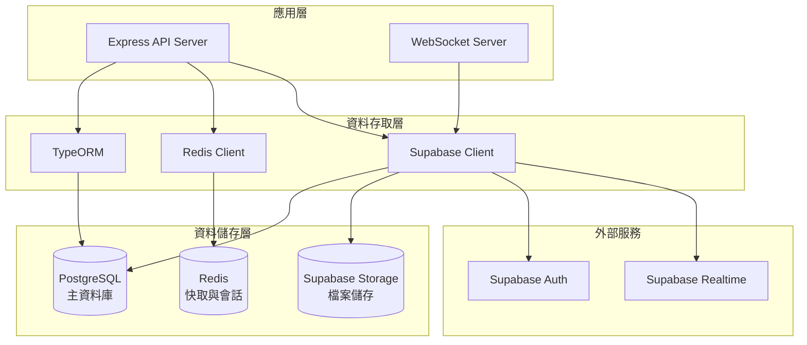

# 資料庫架構設計

## 概述
本文檔詳細說明 Tickeasy 票務系統的資料庫架構設計，包括技術選型、整體架構規劃、設計原則以及擴展策略。

## 技術選型

### 1. 主要資料庫：PostgreSQL
**選擇理由：**
- **ACID 事務支援**：確保票務交易的資料一致性
- **豐富的資料型別**：支援 JSON、Array、UUID 等複雜型別
- **強大的查詢功能**：支援複雜的關聯查詢和聚合操作
- **高可用性**：支援主從複製、讀寫分離
- **開源免費**：降低授權成本

### 2. 雲端服務：Supabase
**選擇理由：**
- **即時功能**：WebSocket 支援即時通知
- **內建身份驗證**：OAuth 和 JWT 整合
- **檔案儲存**：整合 S3 相容的儲存服務
- **管理界面**：提供資料庫管理工具
- **自動備份**：內建備份和復原機制

### 3. ORM 工具：TypeORM
**選擇理由：**
- **TypeScript 原生支援**：型別安全和自動完成
- **活躍記錄模式**：簡化資料操作
- **遷移系統**：版本化資料庫結構變更
- **關聯關係**：優雅的關聯定義和查詢
- **多資料庫支援**：便於未來技術棧調整

## 整體架構

### 1. 資料層架構圖


### 2. 資料分層策略
```typescript
// 資料存取架構分層
interface DataAccessArchitecture {
  // 1. 實體層 (Entity Layer)
  entities: {
    User: UserEntity;
    Concert: ConcertEntity;
    Ticket: TicketEntity;
    Order: OrderEntity;
  };
  
  // 2. 儲存庫層 (Repository Layer)
  repositories: {
    userRepository: UserRepository;
    concertRepository: ConcertRepository;
    ticketRepository: TicketRepository;
    orderRepository: OrderRepository;
  };
  
  // 3. 服務層 (Service Layer)
  services: {
    userService: UserService;
    concertService: ConcertService;
    ticketService: TicketService;
    orderService: OrderService;
  };
  
  // 4. 控制器層 (Controller Layer)
  controllers: {
    userController: UserController;
    concertController: ConcertController;
    ticketController: TicketController;
    orderController: OrderController;
  };
}
```

## 核心資料模型

### 1. 用戶體系
```sql
-- 用戶表
CREATE TABLE users (
    id UUID PRIMARY KEY DEFAULT gen_random_uuid(),
    email VARCHAR(255) UNIQUE NOT NULL,
    username VARCHAR(100) UNIQUE NOT NULL,
    password_hash VARCHAR(255) NOT NULL,
    first_name VARCHAR(100),
    last_name VARCHAR(100),
    phone VARCHAR(20),
    avatar_url TEXT,
    email_verified BOOLEAN DEFAULT FALSE,
    phone_verified BOOLEAN DEFAULT FALSE,
    role VARCHAR(20) DEFAULT 'user' CHECK (role IN ('user', 'organizer', 'admin')),
    status VARCHAR(20) DEFAULT 'active' CHECK (status IN ('active', 'inactive', 'suspended')),
    created_at TIMESTAMP WITH TIME ZONE DEFAULT NOW(),
    updated_at TIMESTAMP WITH TIME ZONE DEFAULT NOW()
);

-- 組織表
CREATE TABLE organizations (
    id UUID PRIMARY KEY DEFAULT gen_random_uuid(),
    name VARCHAR(200) NOT NULL,
    description TEXT,
    website_url TEXT,
    contact_email VARCHAR(255),
    contact_phone VARCHAR(20),
    logo_url TEXT,
    verified BOOLEAN DEFAULT FALSE,
    owner_id UUID REFERENCES users(id) ON DELETE CASCADE,
    created_at TIMESTAMP WITH TIME ZONE DEFAULT NOW(),
    updated_at TIMESTAMP WITH TIME ZONE DEFAULT NOW()
);
```

### 2. 演唱會體系
```sql
-- 場地表
CREATE TABLE venues (
    id UUID PRIMARY KEY DEFAULT gen_random_uuid(),
    name VARCHAR(200) NOT NULL,
    address TEXT NOT NULL,
    city VARCHAR(100) NOT NULL,
    country VARCHAR(100) NOT NULL,
    postal_code VARCHAR(20),
    capacity INTEGER NOT NULL CHECK (capacity > 0),
    facilities JSONB DEFAULT '{}',
    contact_info JSONB DEFAULT '{}',
    created_at TIMESTAMP WITH TIME ZONE DEFAULT NOW(),
    updated_at TIMESTAMP WITH TIME ZONE DEFAULT NOW()
);

-- 演唱會表
CREATE TABLE concerts (
    id UUID PRIMARY KEY DEFAULT gen_random_uuid(),
    title VARCHAR(300) NOT NULL,
    description TEXT,
    artist_name VARCHAR(200) NOT NULL,
    venue_id UUID REFERENCES venues(id) ON DELETE RESTRICT,
    organizer_id UUID REFERENCES users(id) ON DELETE CASCADE,
    organization_id UUID REFERENCES organizations(id) ON DELETE CASCADE,
    start_date TIMESTAMP WITH TIME ZONE NOT NULL,
    end_date TIMESTAMP WITH TIME ZONE NOT NULL,
    poster_url TEXT,
    status VARCHAR(20) DEFAULT 'draft' CHECK (status IN ('draft', 'published', 'cancelled', 'completed')),
    tags JSONB DEFAULT '[]',
    metadata JSONB DEFAULT '{}',
    created_at TIMESTAMP WITH TIME ZONE DEFAULT NOW(),
    updated_at TIMESTAMP WITH TIME ZONE DEFAULT NOW()
);

-- 演唱會場次表
CREATE TABLE concert_sessions (
    id UUID PRIMARY KEY DEFAULT gen_random_uuid(),
    concert_id UUID REFERENCES concerts(id) ON DELETE CASCADE,
    session_name VARCHAR(200),
    start_time TIMESTAMP WITH TIME ZONE NOT NULL,
    end_time TIMESTAMP WITH TIME ZONE NOT NULL,
    doors_open_time TIMESTAMP WITH TIME ZONE,
    status VARCHAR(20) DEFAULT 'scheduled' CHECK (status IN ('scheduled', 'ongoing', 'completed', 'cancelled')),
    created_at TIMESTAMP WITH TIME ZONE DEFAULT NOW(),
    updated_at TIMESTAMP WITH TIME ZONE DEFAULT NOW()
);
```

### 3. 票務體系
```sql
-- 票種表
CREATE TABLE ticket_types (
    id UUID PRIMARY KEY DEFAULT gen_random_uuid(),
    concert_id UUID REFERENCES concerts(id) ON DELETE CASCADE,
    name VARCHAR(200) NOT NULL,
    description TEXT,
    price DECIMAL(10,2) NOT NULL CHECK (price >= 0),
    currency VARCHAR(3) DEFAULT 'TWD',
    total_quantity INTEGER NOT NULL CHECK (total_quantity > 0),
    available_quantity INTEGER NOT NULL CHECK (available_quantity >= 0),
    sale_start_time TIMESTAMP WITH TIME ZONE NOT NULL,
    sale_end_time TIMESTAMP WITH TIME ZONE NOT NULL,
    max_per_order INTEGER DEFAULT 4 CHECK (max_per_order > 0),
    benefits JSONB DEFAULT '[]',
    restrictions JSONB DEFAULT '{}',
    created_at TIMESTAMP WITH TIME ZONE DEFAULT NOW(),
    updated_at TIMESTAMP WITH TIME ZONE DEFAULT NOW()
);

-- 票券表
CREATE TABLE tickets (
    id UUID PRIMARY KEY DEFAULT gen_random_uuid(),
    ticket_type_id UUID REFERENCES ticket_types(id) ON DELETE RESTRICT,
    concert_session_id UUID REFERENCES concert_sessions(id) ON DELETE RESTRICT,
    seat_info JSONB DEFAULT '{}',
    qr_code TEXT UNIQUE,
    status VARCHAR(20) DEFAULT 'available' CHECK (status IN ('available', 'reserved', 'sold', 'used', 'cancelled')),
    reserved_until TIMESTAMP WITH TIME ZONE,
    created_at TIMESTAMP WITH TIME ZONE DEFAULT NOW(),
    updated_at TIMESTAMP WITH TIME ZONE DEFAULT NOW()
);
```

### 4. 訂單體系
```sql
-- 訂單表
CREATE TABLE orders (
    id UUID PRIMARY KEY DEFAULT gen_random_uuid(),
    order_number VARCHAR(50) UNIQUE NOT NULL,
    user_id UUID REFERENCES users(id) ON DELETE CASCADE,
    total_amount DECIMAL(10,2) NOT NULL CHECK (total_amount >= 0),
    currency VARCHAR(3) DEFAULT 'TWD',
    status VARCHAR(20) DEFAULT 'pending' CHECK (status IN ('pending', 'confirmed', 'paid', 'cancelled', 'refunded')),
    payment_method VARCHAR(50),
    payment_status VARCHAR(20) DEFAULT 'pending' CHECK (payment_status IN ('pending', 'processing', 'completed', 'failed', 'refunded')),
    expires_at TIMESTAMP WITH TIME ZONE NOT NULL,
    notes TEXT,
    metadata JSONB DEFAULT '{}',
    created_at TIMESTAMP WITH TIME ZONE DEFAULT NOW(),
    updated_at TIMESTAMP WITH TIME ZONE DEFAULT NOW()
);

-- 訂單項目表
CREATE TABLE order_items (
    id UUID PRIMARY KEY DEFAULT gen_random_uuid(),
    order_id UUID REFERENCES orders(id) ON DELETE CASCADE,
    ticket_id UUID REFERENCES tickets(id) ON DELETE RESTRICT,
    price DECIMAL(10,2) NOT NULL CHECK (price >= 0),
    created_at TIMESTAMP WITH TIME ZONE DEFAULT NOW()
);

-- 付款記錄表
CREATE TABLE payments (
    id UUID PRIMARY KEY DEFAULT gen_random_uuid(),
    order_id UUID REFERENCES orders(id) ON DELETE CASCADE,
    payment_method VARCHAR(50) NOT NULL,
    amount DECIMAL(10,2) NOT NULL CHECK (amount >= 0),
    currency VARCHAR(3) DEFAULT 'TWD',
    status VARCHAR(20) DEFAULT 'pending' CHECK (status IN ('pending', 'processing', 'completed', 'failed', 'cancelled', 'refunded')),
    provider_transaction_id VARCHAR(255),
    provider_response JSONB DEFAULT '{}',
    processed_at TIMESTAMP WITH TIME ZONE,
    created_at TIMESTAMP WITH TIME ZONE DEFAULT NOW(),
    updated_at TIMESTAMP WITH TIME ZONE DEFAULT NOW()
);
```

## 設計原則

### 1. 資料正規化
- **第一正規化 (1NF)**：所有欄位都是原子性的
- **第二正規化 (2NF)**：消除部分功能依賴
- **第三正規化 (3NF)**：消除傳遞功能依賴
- **適度反正規化**：為查詢效能進行有限的反正規化

### 2. 資料完整性約束
```sql
-- 主鍵約束
ALTER TABLE users ADD CONSTRAINT pk_users PRIMARY KEY (id);

-- 外鍵約束
ALTER TABLE concerts ADD CONSTRAINT fk_concerts_venue 
    FOREIGN KEY (venue_id) REFERENCES venues(id);

-- 唯一約束
ALTER TABLE users ADD CONSTRAINT uk_users_email UNIQUE (email);

-- 檢查約束
ALTER TABLE ticket_types ADD CONSTRAINT ck_ticket_types_price 
    CHECK (price >= 0);

-- 非空約束
ALTER TABLE users ALTER COLUMN email SET NOT NULL;
```

### 3. 索引策略
```sql
-- 主鍵索引（自動建立）
-- 外鍵索引
CREATE INDEX idx_concerts_venue_id ON concerts(venue_id);
CREATE INDEX idx_concerts_organizer_id ON concerts(organizer_id);

-- 查詢效能索引
CREATE INDEX idx_concerts_start_date ON concerts(start_date);
CREATE INDEX idx_concerts_status ON concerts(status);

-- 複合索引
CREATE INDEX idx_tickets_type_session ON tickets(ticket_type_id, concert_session_id);
CREATE INDEX idx_orders_user_status ON orders(user_id, status);

-- 部分索引
CREATE INDEX idx_orders_pending ON orders(created_at) 
    WHERE status = 'pending';

-- 表達式索引
CREATE INDEX idx_users_email_lower ON users(LOWER(email));
```

### 4. 資料型別選擇
```sql
-- UUID 作為主鍵
id UUID PRIMARY KEY DEFAULT gen_random_uuid()

-- 金額使用 DECIMAL
price DECIMAL(10,2) NOT NULL

-- 時間戳使用帶時區的類型
created_at TIMESTAMP WITH TIME ZONE DEFAULT NOW()

-- JSON 資料使用 JSONB
metadata JSONB DEFAULT '{}'

-- 列舉值使用 CHECK 約束
status VARCHAR(20) CHECK (status IN ('active', 'inactive'))
```

## 效能優化策略

### 1. 查詢優化
```sql
-- 使用 EXPLAIN ANALYZE 分析查詢計劃
EXPLAIN ANALYZE 
SELECT c.*, v.name AS venue_name
FROM concerts c
JOIN venues v ON c.venue_id = v.id
WHERE c.start_date >= NOW()
AND c.status = 'published';

-- 使用適當的 JOIN 類型
-- INNER JOIN vs LEFT JOIN vs EXISTS
```

### 2. 連接池配置
```typescript
// TypeORM 連接池設定
export const dataSourceOptions: DataSourceOptions = {
  type: 'postgres',
  host: process.env.DB_HOST,
  port: parseInt(process.env.DB_PORT || '5432'),
  username: process.env.DB_USER,
  password: process.env.DB_PASSWORD,
  database: process.env.DB_NAME,
  
  // 連接池設定
  extra: {
    max: 20,              // 最大連接數
    min: 5,               // 最小連接數
    acquire: 30000,       // 獲取連接超時時間
    idle: 10000,          // 連接閒置時間
    evict: 1000,          // 連接驅逐檢查間隔
  },
  
  // 其他設定
  synchronize: false,     // 生產環境關閉自動同步
  logging: process.env.NODE_ENV === 'development',
  entities: ['dist/models/*.js'],
  migrations: ['dist/migrations/*.js'],
};
```

### 3. 快取策略
```typescript
// Redis 快取配置
interface CacheStrategy {
  // 查詢結果快取
  queryCache: {
    ttl: number;          // 生存時間
    key: string;          // 快取鍵
    invalidation: string[]; // 失效觸發條件
  };
  
  // 會話快取
  sessionCache: {
    ttl: number;
    store: 'redis';
  };
  
  // 檔案快取
  fileCache: {
    provider: 'supabase';
    cdn: boolean;
  };
}
```

## 安全性設計

### 1. 資料加密
```sql
-- 敏感資料加密擴展
CREATE EXTENSION IF NOT EXISTS pgcrypto;

-- 加密函數使用
INSERT INTO users (email, password_hash) 
VALUES ('user@example.com', crypt('password', gen_salt('bf')));

-- 驗證密碼
SELECT * FROM users 
WHERE email = 'user@example.com' 
AND password_hash = crypt('password', password_hash);
```

### 2. 權限控制
```sql
-- 建立不同角色
CREATE ROLE app_user;
CREATE ROLE app_admin;

-- 授予適當權限
GRANT SELECT, INSERT, UPDATE ON users TO app_user;
GRANT ALL PRIVILEGES ON ALL TABLES TO app_admin;

-- 行級安全 (RLS)
ALTER TABLE orders ENABLE ROW LEVEL SECURITY;

CREATE POLICY orders_user_policy ON orders
    FOR ALL TO app_user
    USING (user_id = current_setting('app.user_id')::UUID);
```

### 3. 審計日誌
```sql
-- 審計日誌表
CREATE TABLE audit_logs (
    id UUID PRIMARY KEY DEFAULT gen_random_uuid(),
    table_name VARCHAR(100) NOT NULL,
    operation VARCHAR(10) NOT NULL,
    old_values JSONB,
    new_values JSONB,
    user_id UUID,
    ip_address INET,
    user_agent TEXT,
    created_at TIMESTAMP WITH TIME ZONE DEFAULT NOW()
);

-- 觸發器函數
CREATE OR REPLACE FUNCTION audit_trigger_function()
RETURNS TRIGGER AS $$
BEGIN
    INSERT INTO audit_logs (table_name, operation, old_values, new_values)
    VALUES (TG_TABLE_NAME, TG_OP, to_jsonb(OLD), to_jsonb(NEW));
    RETURN NULL;
END;
$$ LANGUAGE plpgsql;
```

## 備份與災難恢復

### 1. 備份策略
```bash
# 完整備份
pg_dump -h localhost -U postgres -d tickeasy > backup_full.sql

# 增量備份（使用 WAL）
archive_command = 'cp %p /backup/archive/%f'
archive_mode = on

# 定期備份腳本
#!/bin/bash
BACKUP_DIR="/backup/$(date +%Y%m%d)"
mkdir -p $BACKUP_DIR
pg_dump -h $DB_HOST -U $DB_USER -d $DB_NAME > $BACKUP_DIR/tickeasy.sql
```

### 2. 恢復程序
```bash
# 從完整備份恢復
psql -h localhost -U postgres -d tickeasy < backup_full.sql

# 時間點恢復
pg_basebackup -h localhost -D /recovery -U postgres
# 設定 recovery.conf 並重啟
```

## 監控與維護

### 1. 效能監控
```sql
-- 查詢效能統計
SELECT query, calls, total_time, mean_time
FROM pg_stat_statements
ORDER BY total_time DESC
LIMIT 10;

-- 索引使用情況
SELECT schemaname, tablename, attname, n_distinct, correlation
FROM pg_stats
WHERE tablename = 'concerts';
```

### 2. 維護任務
```sql
-- 自動清理設定
ALTER TABLE audit_logs SET (autovacuum_enabled = true);

-- 定期重建索引
REINDEX INDEX CONCURRENTLY idx_concerts_start_date;

-- 統計資訊更新
ANALYZE concerts;
```

## 下一步

完成資料庫架構設計後，請繼續閱讀：
- [TypeORM 設定](./02-typeorm-configuration.md)
- [資料模型實作](./03-data-models.md)
- [關聯關係設計](./04-relationships.md)
- [資料庫遷移](./05-migrations.md) 