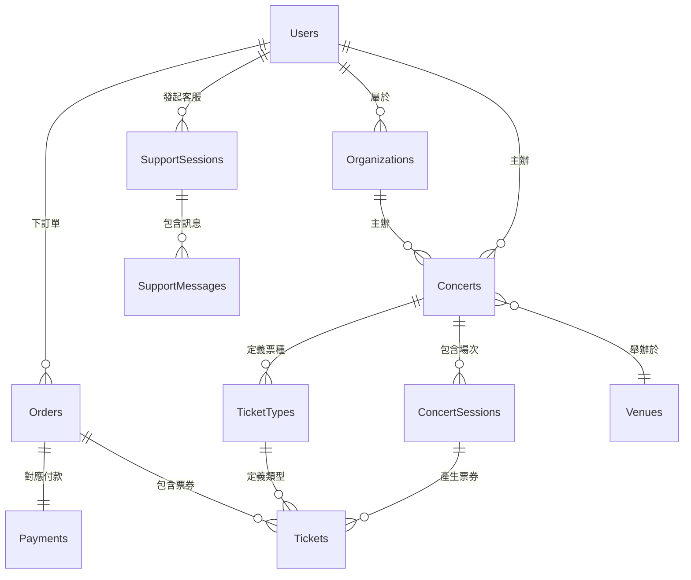

# 第二章：資料庫設計與設定

## 章節概述
本章節詳細介紹 Tickeasy 系統的資料庫設計，包括 PostgreSQL + Supabase 的選擇理由、TypeORM 的設定與使用、以及完整的資料模型設計。

## 目錄
1. [資料庫架構設計](./01-database-architecture.md)
2. [TypeORM 設定](./02-typeorm-configuration.md)
3. [資料模型實作](./03-data-models.md)
4. [關聯關係設計](./04-relationships.md)
5. [資料庫遷移](./05-migrations.md)

## 核心技術
- **資料庫**: PostgreSQL 14+
- **雲端服務**: Supabase
- **ORM**: TypeORM 0.3.x
- **遷移管理**: TypeORM Migration System

## 資料庫架構概覽

```sql
-- 核心業務表
Users (用戶表)
Organizations (組織表)
Concerts (演唱會表)
ConcertSessions (演唱會場次表)
Venues (場地表)
TicketTypes (票種表)
Tickets (票券表)
Orders (訂單表)
Payments (支付表)

-- 支援系統表
SupportSessions (客服會話表)
SupportMessages (客服訊息表)
SupportSchedule (客服排程表)
SupportKnowledgeBase (知識庫表)

-- 標籤與分類表
MusicTags (音樂標籤表)
LocationTags (地點標籤表)
ConcertReviews (演唱會評論表)
```

## 實體關係圖 (ERD)



## 設計原則

### 1. 正規化設計
- 符合第三正規化 (3NF)
- 避免資料重複
- 保持資料一致性

### 2. 索引策略
- 主鍵自動索引
- 外鍵索引
- 查詢頻繁欄位建立索引
- 複合索引優化查詢效能

### 3. 資料完整性
- 主鍵約束 (Primary Key)
- 外鍵約束 (Foreign Key)
- 唯一約束 (Unique)
- 檢查約束 (Check)

### 4. 效能考量
- 適當的資料型別選擇
- 索引優化
- 查詢效能監控
- 連接池管理

## 安全性設計

### 1. 資料加密
- 密碼使用 bcrypt 雜湊
- 敏感資料欄位加密
- 傳輸層 SSL/TLS 加密

### 2. 存取控制
- 資料庫用戶權限管理
- 應用層權限控制
- API 端點保護

### 3. 稽核日誌
- 重要操作記錄
- 資料異動追蹤
- 錯誤日誌記錄

## Supabase 整合

### 1. 即時功能
- 資料庫異動即時通知
- WebSocket 連接管理
- 即時客服系統

### 2. 檔案儲存
- Supabase Storage 整合
- 圖片上傳與管理
- CDN 加速

### 3. 身份驗證
- Supabase Auth 整合
- OAuth 提供者設定
- 用戶會話管理

## 效能優化

### 1. 查詢優化
- 索引策略
- 查詢計劃分析
- N+1 查詢問題解決

### 2. 連接管理
- 連接池設定
- 連線重用
- 連線監控

### 3. 快取策略
- 查詢結果快取
- Redis 整合
- 快取失效策略 