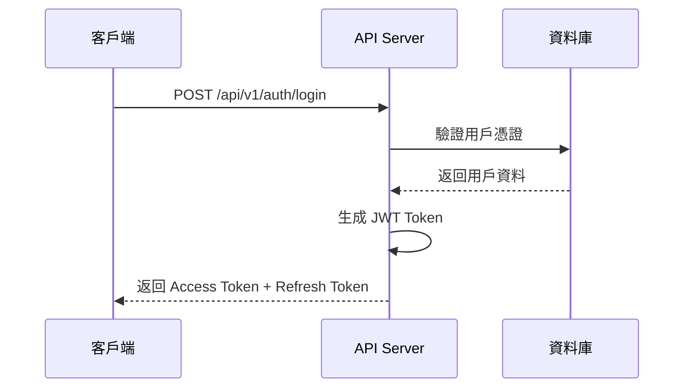
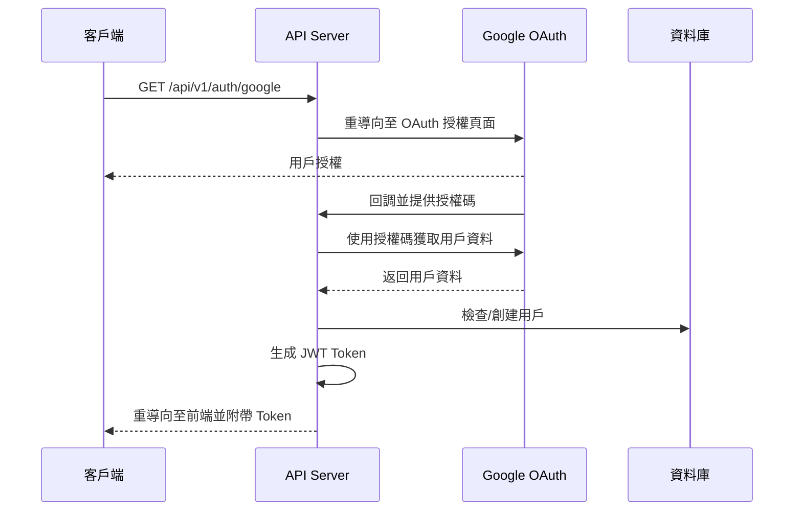

# 第四章：身份驗證與授權系統

## 章節概述
本章節深入探討 Tickeasy 系統的身份驗證與授權機制，包括 JWT 實作、Passport.js OAuth 整合、以及完整的權限控制系統設計。

## 目錄
1. [JWT 身份驗證機制](./01-jwt-authentication.md)
2. [Passport.js OAuth 整合](./02-oauth-integration.md)
3. [認證中間件設計](./03-auth-middleware.md)
4. [權限控制系統](./04-authorization.md)
5. [安全性最佳實務](./05-security-practices.md)

## 技術架構

```
身份驗證層
├── JWT Token 管理
│   ├── Access Token (短期)
│   └── Refresh Token (長期)
├── OAuth 整合
│   ├── Google OAuth 2.0
│   └── 第三方登入流程
├── 中間件系統
│   ├── 身份驗證中間件
│   └── 權限檢查中間件
└── 安全性機制
    ├── Rate Limiting
    ├── CSRF 保護
    └── XSS 防護
```

## 認證流程設計

### 1. 本地登入流程


### 2. OAuth 登入流程


## JWT Token 設計

### Token 結構
```typescript
// Access Token Payload
interface AccessTokenPayload {
  userId: string;
  email: string;
  role: string;
  organizationId?: string;
  iat: number;  // 簽發時間
  exp: number;  // 過期時間 (15分鐘)
}

// Refresh Token Payload
interface RefreshTokenPayload {
  userId: string;
  tokenId: string;  // 唯一識別碼
  iat: number;      // 簽發時間
  exp: number;      // 過期時間 (7天)
}
```

### Token 安全性
- **Access Token**: 短期有效 (15分鐘)，包含用戶權限資訊
- **Refresh Token**: 長期有效 (7天)，用於更新 Access Token
- **Token Rotation**: 每次刷新時更新 Refresh Token
- **Token Blacklist**: 登出時將 Token 加入黑名單

## 權限控制系統

### 角色定義
```typescript
enum UserRole {
  ADMIN = 'admin',           // 系統管理員
  ORGANIZER = 'organizer',   // 主辦方
  USER = 'user'              // 一般用戶
}

enum Permission {
  // 用戶管理
  USER_READ = 'user:read',
  USER_WRITE = 'user:write',
  
  // 演唱會管理
  CONCERT_READ = 'concert:read',
  CONCERT_WRITE = 'concert:write',
  CONCERT_APPROVE = 'concert:approve',
  
  // 訂單管理
  ORDER_READ = 'order:read',
  ORDER_WRITE = 'order:write',
  
  // 系統管理
  SYSTEM_ADMIN = 'system:admin'
}
```

### 權限矩陣
| 角色 | 用戶管理 | 演唱會管理 | 訂單管理 | 系統管理 |
|------|----------|------------|----------|----------|
| USER | 自己 | 瀏覽 | 自己 | ❌ |
| ORGANIZER | 自己 | 所屬組織 | 所屬組織 | ❌ |
| ADMIN | ✅ | ✅ | ✅ | ✅ |

## 中間件實作

### 身份驗證中間件
```typescript
// middlewares/auth.ts
export const authenticateToken = async (
  req: Request, 
  res: Response, 
  next: NextFunction
) => {
  try {
    const authHeader = req.headers.authorization;
    const token = authHeader?.split(' ')[1];
    
    if (!token) {
      return res.status(401).json({
        status: 'failed',
        message: '未提供認證令牌'
      });
    }
    
    // 驗證 JWT Token
    const decoded = jwt.verify(token, process.env.JWT_SECRET!);
    req.user = decoded as AccessTokenPayload;
    
    next();
  } catch (error) {
    return res.status(403).json({
      status: 'failed',
      message: '無效的認證令牌'
    });
  }
};
```

### 權限檢查中間件
```typescript
// middlewares/auth.ts
export const requirePermission = (permission: Permission) => {
  return async (req: Request, res: Response, next: NextFunction) => {
    const user = req.user as AccessTokenPayload;
    
    // 檢查用戶是否具有所需權限
    const hasPermission = await checkUserPermission(user.userId, permission);
    
    if (!hasPermission) {
      return res.status(403).json({
        status: 'failed',
        message: '權限不足'
      });
    }
    
    next();
  };
};
```

## 安全性措施

### 1. Rate Limiting
```typescript
import rateLimit from 'express-rate-limit';

// 登入端點限制
export const loginLimiter = rateLimit({
  windowMs: 15 * 60 * 1000, // 15分鐘
  max: 5, // 最多5次嘗試
  message: '登入嘗試次數過多，請稍後再試',
  standardHeaders: true,
  legacyHeaders: false
});
```

### 2. CSRF 保護
```typescript
import csrf from 'csurf';

// CSRF 保護中間件
export const csrfProtection = csrf({
  cookie: {
    httpOnly: true,
    secure: process.env.NODE_ENV === 'production',
    sameSite: 'strict'
  }
});
```

### 3. 密碼安全
```typescript
import bcrypt from 'bcrypt';

// 密碼雜湊
export const hashPassword = async (password: string): Promise<string> => {
  const saltRounds = 12;
  return await bcrypt.hash(password, saltRounds);
};

// 密碼驗證
export const verifyPassword = async (
  password: string, 
  hashedPassword: string
): Promise<boolean> => {
  return await bcrypt.compare(password, hashedPassword);
};
```

## OAuth 整合實作

### Google OAuth 設定
```typescript
// config/passport.ts
import { Strategy as GoogleStrategy } from 'passport-google-oauth20';

passport.use(new GoogleStrategy({
  clientID: process.env.GOOGLE_CLIENT_ID!,
  clientSecret: process.env.GOOGLE_CLIENT_SECRET!,
  callbackURL: process.env.GOOGLE_CALLBACK_URL!
}, async (accessToken, refreshToken, profile, done) => {
  try {
    // 檢查用戶是否已存在
    let user = await User.findOne({ 
      where: { googleId: profile.id } 
    });
    
    if (!user) {
      // 創建新用戶
      user = await User.create({
        googleId: profile.id,
        email: profile.emails?.[0]?.value,
        name: profile.displayName,
        avatar: profile.photos?.[0]?.value,
        isEmailVerified: true
      });
    }
    
    return done(null, user);
  } catch (error) {
    return done(error, null);
  }
}));
```

## 錯誤處理

### 認證錯誤類型
```typescript
export enum AuthErrorCode {
  INVALID_CREDENTIALS = 'AUTH_001',
  TOKEN_EXPIRED = 'AUTH_002',
  TOKEN_INVALID = 'AUTH_003',
  INSUFFICIENT_PERMISSIONS = 'AUTH_004',
  ACCOUNT_LOCKED = 'AUTH_005',
  EMAIL_NOT_VERIFIED = 'AUTH_006'
}

export class AuthError extends Error {
  constructor(
    public code: AuthErrorCode,
    public message: string,
    public statusCode: number = 401
  ) {
    super(message);
    this.name = 'AuthError';
  }
}
```

## 最佳實務總結

### 1. Token 管理
- ✅ 使用短期 Access Token + 長期 Refresh Token
- ✅ 實作 Token Rotation 機制
- ✅ 提供 Token 撤銷功能
- ✅ 監控異常 Token 使用

### 2. 密碼政策
- ✅ 強制複雜密碼
- ✅ 密碼雜湊使用 bcrypt
- ✅ 實作帳號鎖定機制
- ✅ 定期提醒密碼更新

### 3. OAuth 安全
- ✅ 驗證 OAuth 回調來源
- ✅ 使用 State 參數防止 CSRF
- ✅ 安全儲存 OAuth Token
- ✅ 定期更新 OAuth 配置

### 4. 監控與稽核
- ✅ 記錄所有認證事件
- ✅ 監控異常登入行為
- ✅ 實作安全警報機制
- ✅ 定期安全性評估 