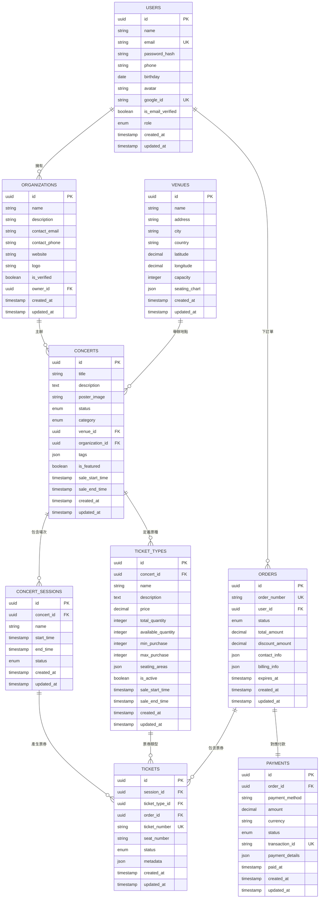
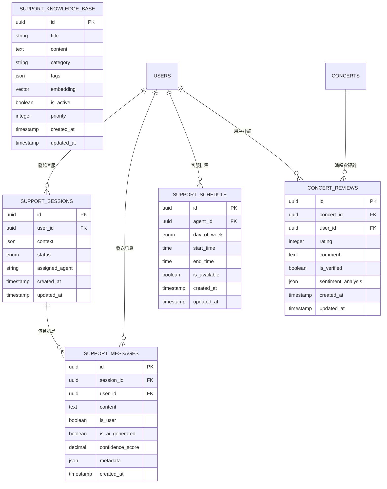

# Tickeasy 資料庫架構圖

## 概述
本文檔詳細說明 Tickeasy 票務系統的資料庫架構設計，包括實體關係圖、資料表結構、索引策略和查詢優化。

## 實體關係圖 (ERD)

### 核心業務實體關係


### 支援系統實體關係


## 資料表詳細結構

### 核心業務表

#### 1. users (用戶表)
```sql
CREATE TABLE users (
    id UUID PRIMARY KEY DEFAULT gen_random_uuid(),
    name VARCHAR(255) NOT NULL,
    email VARCHAR(255) UNIQUE NOT NULL,
    password_hash VARCHAR(255),
    phone VARCHAR(50),
    birthday DATE,
    avatar TEXT,
    google_id VARCHAR(255) UNIQUE,
    is_email_verified BOOLEAN DEFAULT FALSE,
    role user_role DEFAULT 'user',
    created_at TIMESTAMP WITH TIME ZONE DEFAULT NOW(),
    updated_at TIMESTAMP WITH TIME ZONE DEFAULT NOW()
);

-- 索引
CREATE INDEX idx_users_email ON users(email);
CREATE INDEX idx_users_google_id ON users(google_id) WHERE google_id IS NOT NULL;
CREATE INDEX idx_users_role ON users(role);
CREATE INDEX idx_users_created_at ON users(created_at);
```

#### 2. organizations (組織表)
```sql
CREATE TABLE organizations (
    id UUID PRIMARY KEY DEFAULT gen_random_uuid(),
    name VARCHAR(255) NOT NULL,
    description TEXT,
    contact_email VARCHAR(255),
    contact_phone VARCHAR(50),
    website VARCHAR(255),
    logo TEXT,
    is_verified BOOLEAN DEFAULT FALSE,
    owner_id UUID NOT NULL REFERENCES users(id) ON DELETE CASCADE,
    created_at TIMESTAMP WITH TIME ZONE DEFAULT NOW(),
    updated_at TIMESTAMP WITH TIME ZONE DEFAULT NOW()
);

-- 索引
CREATE INDEX idx_organizations_owner_id ON organizations(owner_id);
CREATE INDEX idx_organizations_is_verified ON organizations(is_verified);
CREATE INDEX idx_organizations_name ON organizations(name);
```

#### 3. venues (場地表)
```sql
CREATE TABLE venues (
    id UUID PRIMARY KEY DEFAULT gen_random_uuid(),
    name VARCHAR(255) NOT NULL,
    address TEXT NOT NULL,
    city VARCHAR(100) NOT NULL,
    country VARCHAR(100) NOT NULL,
    latitude DECIMAL(10, 8),
    longitude DECIMAL(11, 8),
    capacity INTEGER,
    seating_chart JSONB,
    created_at TIMESTAMP WITH TIME ZONE DEFAULT NOW(),
    updated_at TIMESTAMP WITH TIME ZONE DEFAULT NOW()
);

-- 索引
CREATE INDEX idx_venues_city ON venues(city);
CREATE INDEX idx_venues_country ON venues(country);
CREATE INDEX idx_venues_capacity ON venues(capacity);
CREATE INDEX idx_venues_location ON venues USING GIST(point(longitude, latitude));
```

#### 4. concerts (演唱會表)
```sql
CREATE TYPE concert_status AS ENUM ('draft', 'published', 'ongoing', 'completed', 'cancelled');
CREATE TYPE concert_category AS ENUM ('pop', 'rock', 'classical', 'jazz', 'electronic', 'folk', 'other');

CREATE TABLE concerts (
    id UUID PRIMARY KEY DEFAULT gen_random_uuid(),
    title VARCHAR(255) NOT NULL,
    description TEXT,
    poster_image TEXT,
    status concert_status DEFAULT 'draft',
    category concert_category DEFAULT 'other',
    venue_id UUID NOT NULL REFERENCES venues(id),
    organization_id UUID NOT NULL REFERENCES organizations(id),
    tags JSONB DEFAULT '[]',
    is_featured BOOLEAN DEFAULT FALSE,
    sale_start_time TIMESTAMP WITH TIME ZONE,
    sale_end_time TIMESTAMP WITH TIME ZONE,
    created_at TIMESTAMP WITH TIME ZONE DEFAULT NOW(),
    updated_at TIMESTAMP WITH TIME ZONE DEFAULT NOW()
);

-- 索引
CREATE INDEX idx_concerts_status ON concerts(status);
CREATE INDEX idx_concerts_category ON concerts(category);
CREATE INDEX idx_concerts_venue_id ON concerts(venue_id);
CREATE INDEX idx_concerts_organization_id ON concerts(organization_id);
CREATE INDEX idx_concerts_is_featured ON concerts(is_featured);
CREATE INDEX idx_concerts_sale_time ON concerts(sale_start_time, sale_end_time);
CREATE INDEX idx_concerts_tags ON concerts USING GIN(tags);
CREATE INDEX idx_concerts_title_search ON concerts USING GIN(to_tsvector('english', title));
```

#### 5. concert_sessions (演唱會場次表)
```sql
CREATE TYPE session_status AS ENUM ('scheduled', 'ongoing', 'completed', 'cancelled');

CREATE TABLE concert_sessions (
    id UUID PRIMARY KEY DEFAULT gen_random_uuid(),
    concert_id UUID NOT NULL REFERENCES concerts(id) ON DELETE CASCADE,
    name VARCHAR(255) NOT NULL,
    start_time TIMESTAMP WITH TIME ZONE NOT NULL,
    end_time TIMESTAMP WITH TIME ZONE NOT NULL,
    status session_status DEFAULT 'scheduled',
    created_at TIMESTAMP WITH TIME ZONE DEFAULT NOW(),
    updated_at TIMESTAMP WITH TIME ZONE DEFAULT NOW()
);

-- 索引
CREATE INDEX idx_concert_sessions_concert_id ON concert_sessions(concert_id);
CREATE INDEX idx_concert_sessions_start_time ON concert_sessions(start_time);
CREATE INDEX idx_concert_sessions_status ON concert_sessions(status);
```

#### 6. ticket_types (票種表)
```sql
CREATE TABLE ticket_types (
    id UUID PRIMARY KEY DEFAULT gen_random_uuid(),
    concert_id UUID NOT NULL REFERENCES concerts(id) ON DELETE CASCADE,
    name VARCHAR(255) NOT NULL,
    description TEXT,
    price DECIMAL(10, 2) NOT NULL,
    total_quantity INTEGER NOT NULL,
    available_quantity INTEGER NOT NULL,
    min_purchase INTEGER DEFAULT 1,
    max_purchase INTEGER DEFAULT 10,
    seating_areas JSONB DEFAULT '[]',
    is_active BOOLEAN DEFAULT TRUE,
    sale_start_time TIMESTAMP WITH TIME ZONE,
    sale_end_time TIMESTAMP WITH TIME ZONE,
    created_at TIMESTAMP WITH TIME ZONE DEFAULT NOW(),
    updated_at TIMESTAMP WITH TIME ZONE DEFAULT NOW(),
    
    CONSTRAINT chk_quantity_valid CHECK (available_quantity >= 0 AND available_quantity <= total_quantity),
    CONSTRAINT chk_purchase_limits CHECK (min_purchase > 0 AND max_purchase >= min_purchase),
    CONSTRAINT chk_price_positive CHECK (price >= 0)
);

-- 索引
CREATE INDEX idx_ticket_types_concert_id ON ticket_types(concert_id);
CREATE INDEX idx_ticket_types_is_active ON ticket_types(is_active);
CREATE INDEX idx_ticket_types_price ON ticket_types(price);
CREATE INDEX idx_ticket_types_available ON ticket_types(available_quantity) WHERE available_quantity > 0;
```

#### 7. orders (訂單表)
```sql
CREATE TYPE order_status AS ENUM ('pending', 'confirmed', 'paid', 'cancelled', 'expired', 'refunded');

CREATE TABLE orders (
    id UUID PRIMARY KEY DEFAULT gen_random_uuid(),
    order_number VARCHAR(50) UNIQUE NOT NULL,
    user_id UUID NOT NULL REFERENCES users(id),
    status order_status DEFAULT 'pending',
    total_amount DECIMAL(10, 2) NOT NULL,
    discount_amount DECIMAL(10, 2) DEFAULT 0,
    contact_info JSONB NOT NULL,
    billing_info JSONB,
    expires_at TIMESTAMP WITH TIME ZONE,
    created_at TIMESTAMP WITH TIME ZONE DEFAULT NOW(),
    updated_at TIMESTAMP WITH TIME ZONE DEFAULT NOW(),
    
    CONSTRAINT chk_amounts_valid CHECK (total_amount >= 0 AND discount_amount >= 0)
);

-- 索引
CREATE UNIQUE INDEX idx_orders_order_number ON orders(order_number);
CREATE INDEX idx_orders_user_id ON orders(user_id);
CREATE INDEX idx_orders_status ON orders(status);
CREATE INDEX idx_orders_created_at ON orders(created_at);
CREATE INDEX idx_orders_expires_at ON orders(expires_at) WHERE expires_at IS NOT NULL;
```

#### 8. payments (支付表)
```sql
CREATE TYPE payment_status AS ENUM ('pending', 'processing', 'completed', 'failed', 'cancelled', 'refunded');

CREATE TABLE payments (
    id UUID PRIMARY KEY DEFAULT gen_random_uuid(),
    order_id UUID NOT NULL REFERENCES orders(id) ON DELETE CASCADE,
    payment_method VARCHAR(50) NOT NULL,
    amount DECIMAL(10, 2) NOT NULL,
    currency VARCHAR(3) DEFAULT 'TWD',
    status payment_status DEFAULT 'pending',
    transaction_id VARCHAR(255) UNIQUE,
    payment_details JSONB,
    paid_at TIMESTAMP WITH TIME ZONE,
    created_at TIMESTAMP WITH TIME ZONE DEFAULT NOW(),
    updated_at TIMESTAMP WITH TIME ZONE DEFAULT NOW(),
    
    CONSTRAINT chk_amount_positive CHECK (amount > 0)
);

-- 索引
CREATE INDEX idx_payments_order_id ON payments(order_id);
CREATE INDEX idx_payments_status ON payments(status);
CREATE INDEX idx_payments_transaction_id ON payments(transaction_id) WHERE transaction_id IS NOT NULL;
CREATE INDEX idx_payments_paid_at ON payments(paid_at);
```

### 支援系統表

#### 9. support_knowledge_base (知識庫表)
```sql
-- 需要啟用 vector 擴展
CREATE EXTENSION IF NOT EXISTS vector;

CREATE TABLE support_knowledge_base (
    id UUID PRIMARY KEY DEFAULT gen_random_uuid(),
    title VARCHAR(500) NOT NULL,
    content TEXT NOT NULL,
    category VARCHAR(100) NOT NULL,
    tags JSONB DEFAULT '[]',
    embedding VECTOR(1536), -- OpenAI embedding 維度
    is_active BOOLEAN DEFAULT TRUE,
    priority INTEGER DEFAULT 0,
    created_at TIMESTAMP WITH TIME ZONE DEFAULT NOW(),
    updated_at TIMESTAMP WITH TIME ZONE DEFAULT NOW()
);

-- 索引
CREATE INDEX idx_knowledge_category ON support_knowledge_base(category);
CREATE INDEX idx_knowledge_is_active ON support_knowledge_base(is_active);
CREATE INDEX idx_knowledge_priority ON support_knowledge_base(priority DESC);
CREATE INDEX idx_knowledge_tags ON support_knowledge_base USING GIN(tags);
CREATE INDEX idx_knowledge_content_search ON support_knowledge_base USING GIN(to_tsvector('english', content));
CREATE INDEX idx_knowledge_embedding ON support_knowledge_base USING ivfflat (embedding vector_cosine_ops) 
WITH (lists = 100);
```

#### 10. support_sessions (客服會話表)
```sql
CREATE TYPE support_session_status AS ENUM ('active', 'waiting', 'resolved', 'closed');

CREATE TABLE support_sessions (
    id UUID PRIMARY KEY DEFAULT gen_random_uuid(),
    user_id UUID REFERENCES users(id),
    context JSONB DEFAULT '{}',
    status support_session_status DEFAULT 'active',
    assigned_agent VARCHAR(255),
    created_at TIMESTAMP WITH TIME ZONE DEFAULT NOW(),
    updated_at TIMESTAMP WITH TIME ZONE DEFAULT NOW()
);

-- 索引
CREATE INDEX idx_support_sessions_user_id ON support_sessions(user_id);
CREATE INDEX idx_support_sessions_status ON support_sessions(status);
CREATE INDEX idx_support_sessions_created_at ON support_sessions(created_at);
```

## 查詢優化範例

### 1. 演唱會搜尋查詢
```sql
-- 複合查詢：按地點、分類、時間範圍搜尋演唱會
EXPLAIN ANALYZE
SELECT 
    c.id,
    c.title,
    c.poster_image,
    v.name as venue_name,
    v.city,
    o.name as organizer_name,
    MIN(cs.start_time) as earliest_session,
    MIN(tt.price) as min_price
FROM concerts c
JOIN venues v ON c.venue_id = v.id
JOIN organizations o ON c.organization_id = o.id
JOIN concert_sessions cs ON c.id = cs.concert_id
JOIN ticket_types tt ON c.id = tt.concert_id
WHERE 
    c.status = 'published'
    AND v.city = $1
    AND c.category = $2
    AND cs.start_time BETWEEN $3 AND $4
    AND tt.available_quantity > 0
GROUP BY c.id, c.title, c.poster_image, v.name, v.city, o.name
ORDER BY earliest_session
LIMIT 20;
```

### 2. 用戶訂單歷史查詢
```sql
-- 用戶訂單詳細資訊
SELECT 
    o.order_number,
    o.status as order_status,
    o.total_amount,
    o.created_at as order_date,
    c.title as concert_title,
    v.name as venue_name,
    cs.start_time,
    COUNT(t.id) as ticket_count,
    p.status as payment_status,
    p.paid_at
FROM orders o
JOIN tickets t ON o.id = t.order_id
JOIN concert_sessions cs ON t.session_id = cs.id
JOIN concerts c ON cs.concert_id = c.id
JOIN venues v ON c.venue_id = v.id
LEFT JOIN payments p ON o.id = p.order_id
WHERE o.user_id = $1
GROUP BY o.id, c.id, v.id, cs.id, p.id
ORDER BY o.created_at DESC;
```

### 3. AI 客服知識庫搜尋
```sql
-- 向量相似度搜尋
SELECT 
    id,
    title,
    content,
    category,
    1 - (embedding <=> $1) as similarity
FROM support_knowledge_base
WHERE 
    is_active = true
    AND 1 - (embedding <=> $1) > 0.7
ORDER BY similarity DESC
LIMIT 5;
```

## 效能監控指標

### 關鍵查詢監控
```sql
-- 慢查詢監控
SELECT 
    query,
    calls,
    total_time,
    mean_time,
    rows
FROM pg_stat_statements
WHERE mean_time > 100  -- 平均執行時間超過 100ms
ORDER BY mean_time DESC
LIMIT 10;
```

### 索引使用統計
```sql
-- 索引使用情況
SELECT 
    schemaname,
    tablename,
    indexname,
    idx_scan,
    idx_tup_read,
    idx_tup_fetch
FROM pg_stat_user_indexes
ORDER BY idx_scan DESC;
```

### 資料表大小監控
```sql
-- 資料表大小統計
SELECT 
    tablename,
    pg_size_pretty(pg_total_relation_size(tablename::regclass)) as size,
    pg_total_relation_size(tablename::regclass) as size_bytes
FROM pg_tables
WHERE schemaname = 'public'
ORDER BY size_bytes DESC;
```

## 維護策略

### 1. 定期清理作業
```sql
-- 清理過期的未付款訂單
DELETE FROM orders 
WHERE status = 'pending' 
  AND expires_at < NOW() - INTERVAL '1 day';

-- 清理舊的客服會話
DELETE FROM support_sessions 
WHERE status = 'closed' 
  AND updated_at < NOW() - INTERVAL '90 days';
```

### 2. 統計資料更新
```sql
-- 更新查詢計劃統計資料
ANALYZE;

-- 重建索引 (如有需要)
REINDEX INDEX CONCURRENTLY idx_concerts_title_search;
```

### 3. 備份策略
```bash
# 每日備份
pg_dump -h $DB_HOST -U $DB_USER -d $DB_NAME --compress=9 --no-owner --no-privileges > backup_$(date +%Y%m%d).sql.gz

# 增量備份 (使用 WAL)
pg_basebackup -h $DB_HOST -U $DB_USER -D /backup/base -Ft -z -P
```

## 資料遷移腳本範例

### 添加新欄位遷移
```sql
-- 20240301_add_concert_metadata.sql
BEGIN;

-- 添加新欄位
ALTER TABLE concerts 
ADD COLUMN metadata JSONB DEFAULT '{}',
ADD COLUMN external_id VARCHAR(255),
ADD COLUMN sync_status VARCHAR(50) DEFAULT 'synced';

-- 建立索引
CREATE INDEX idx_concerts_external_id ON concerts(external_id) 
WHERE external_id IS NOT NULL;

CREATE INDEX idx_concerts_sync_status ON concerts(sync_status);

-- 更新現有資料
UPDATE concerts 
SET metadata = '{}'::jsonb 
WHERE metadata IS NULL;

COMMIT;
```

這個資料庫架構設計確保了 Tickeasy 系統的高效性、可擴展性和維護性，同時支援複雜的業務邏輯和 AI 功能需求。 